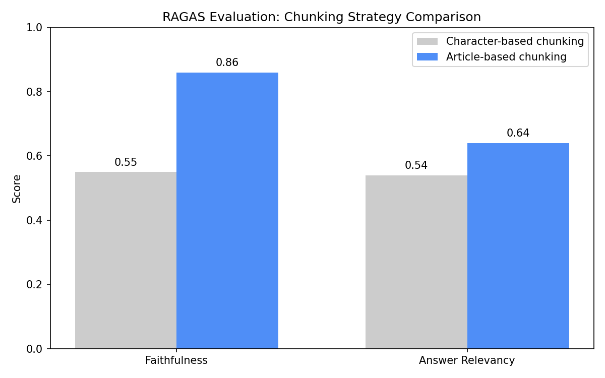

# 🇳🇱 Dutch Constitution Q&A, RAG Pipeline with Evaluation

A production-style Retrieval-Augmented Generation (RAG) system that answers questions about the **Dutch Constitution (2023)** with Article citations, grounded entirely in the source document. Includes an automated RAGAS evaluation layer, MLflow experiment tracking, GitHub Actions CI/CD, and a documented engineering iteration showing measurable improvement.

**[▶ Live Demo](https://huggingface.co/spaces/aliabbi/dutch-constitution-qa)** · **[GitHub](https://github.com/aghababaeiali/rag-document-qa)**

---

## Why This Project

Most junior ML portfolios show fine-tuning. This project demonstrates a different and increasingly demanded skill set: **building, evaluating, and iterating on a complete GenAI system**, using the tools Dutch ML teams actually use in production.

Three differentiators:

1. **RAGAS evaluation**, quantitative, reproducible answers to "how good is your RAG pipeline?"
2. **MLflow experiment tracking**, every change is measured, every result reproducible
3. **Documented improvement loop**, identified a failure mode, fixed it, measured the impact

---

## Results, Engineering Iteration Documented

The first version used `RecursiveCharacterTextSplitter` with 500-character chunks. MLflow tracking revealed that short articles (e.g., Article 43, ~110 characters) were being absorbed into mixed chunks alongside unrelated articles, causing retrieval failures on specific questions.

Replacing character-based chunking with **structure-aware splitting on `Article N` regex patterns** improved faithfulness from 0.55 to 0.86, a 31-point gain.

| Metric | Character-based (v1) | Article-based (v2) | Δ |
|---|---|---|---|
| **Faithfulness** | 0.55 | **0.86** | +0.31 |
| **Answer Relevancy** | 0.54 | 0.64 | +0.10 |

The A/B comparison was tracked in MLflow across 5 evaluation runs.



---

## Architecture

```
PDF Document (Dutch Constitution 2023)
         ↓  [ingest.py]
Load → Article-aware split (regex on "Article N") → Embed (MiniLM-L6-v2) → ChromaDB
         ↓  [retriever.py]
Query → Embed → Cosine similarity search → Top-3 chunks
         ↓  [chain.py]
Chunks + Question → Prompt → Llama 3.1 (Groq) → Grounded answer
         ↓  [evaluate.py]
RAGAS → Faithfulness + Answer Relevancy scores → MLflow
```

**Serving layer:**
- `main.py`, FastAPI REST API (`POST /ask`)
- `demo.py`, Gradio web UI (HuggingFace Spaces)

---

## CI/CD Pipeline

Every push to main triggers an automated pipeline:

1. **Test job**, pytest suite (13 tests covering retriever, RAG chain, FastAPI layer) runs on Ubuntu with Python 3.11
2. **Deploy job**, if tests pass, the repo is force-pushed to HuggingFace Space, triggering automatic redeploy

Pull requests run tests only, deployment is gated on direct pushes to main. Pipeline preserves HuggingFace's Space-specific README front matter automatically.

Pipeline config: `.github/workflows/ci-cd.yml`

---

## Experiment Tracking with MLflow

All evaluation runs are logged to MLflow with:

- **Parameters**, chunking strategy, chunk size, embedding model, LLM model, top-k retrieval
- **Metrics**, per-question and aggregate RAGAS scores
- **Artifacts**, full evaluation results as JSON, comparison charts

This was used to A/B test the chunking strategy upgrade. The MLflow UI made the regression analysis trivial, comparing 5 runs side-by-side immediately surfaced the questions where character-based chunking was failing.

Tracking config: `MLFLOW_TRACKING_URI` (defaults to local SQLite, configurable to PostgreSQL/S3 for production deployment).

```bash
# View runs locally
mlflow ui --backend-store-uri sqlite:///mlflow.db
```

Instrumentation: `app/evaluate.py`

---

## Stack

| Layer | Tool | Why |
|---|---|---|
| Orchestration | LangChain (LCEL) | Standard in NL job market; provider-agnostic abstraction |
| Vector store | ChromaDB | Zero-config local persistence, cosine similarity |
| Embeddings | `all-MiniLM-L6-v2` | Free, CPU-efficient, strong semantic retrieval baseline |
| LLM | Llama 3.1 8B via Groq | Free tier, fast inference, open-source model |
| Evaluation | RAGAS | Reference-free RAG evaluation, faithfulness + relevancy |
| Experiment tracking | MLflow | Production-standard, swappable backends (SQLite → PostgreSQL) |
| API | FastAPI | Auto-generated docs, Pydantic validation, async support |
| UI | Gradio | Standard ML demo interface |
| Container | Docker | Reproducible deployment, CPU-only PyTorch for lean image |
| CI/CD | GitHub Actions | Automated testing + deployment on every push |

---

## Project Structure

```
rag-document-qa/
│
├── app/
│   ├── ingest.py            # PDF download → article-aware split → embed → ChromaDB
│   ├── retriever.py         # Semantic search over stored vectors
│   ├── chain.py             # RAG chain: retrieve → prompt → LLM
│   └── evaluate.py          # RAGAS evaluation + MLflow tracking
│
├── data/
│   ├── sample_docs/         # Source PDFs (downloaded at runtime)
│   └── chroma_db/           # Vector store (built at runtime)
│
├── tests/
│   └── test_pipeline.py     # 13 pytest tests
│
├── .github/workflows/
│   └── ci-cd.yml            # CI/CD pipeline definition
│
├── mlruns/                  # MLflow artifact store (gitignored)
│
├── main.py                  # FastAPI REST API
├── demo.py                  # Gradio web UI
├── Dockerfile
├── requirements.txt
├── chunking_comparison.png  # A/B test results visualization
├── .env.example
└── README.md
```

---

## Quick Start

### Prerequisites
- Python 3.11
- [Groq API key](https://console.groq.com) (free)

### Setup

```bash
git clone https://github.com/aghababaeiali/rag-document-qa
cd rag-document-qa

python3.11 -m venv venv
source venv/bin/activate
pip install -r requirements.txt

cp .env.example .env
# Add your GROQ_API_KEY to .env
# Optionally add MLFLOW_TRACKING_URI (defaults to sqlite:///mlflow.db)
```

### Ingest the document

```bash
python -m app.ingest
```

This downloads the Constitution PDF (if not present), splits it on Article boundaries (~142 article-level chunks), embeds them with `all-MiniLM-L6-v2`, and stores them in ChromaDB.

> **Note:** On HuggingFace Spaces, the PDF is downloaded automatically from
> [open.overheid.nl](https://open.overheid.nl) and ChromaDB is built on first
> startup, no manual setup needed.

### Run the Gradio demo

```bash
python demo.py
# → http://localhost:7860
```

### Run the FastAPI server

```bash
uvicorn main:app --reload
# → http://localhost:8000
# → http://localhost:8000/docs  (interactive API docs)
```

### Run evaluation with MLflow tracking

```bash
python -m app.evaluate
mlflow ui --backend-store-uri sqlite:///mlflow.db
# → http://localhost:5000
```

---

## Example Queries

| Question | Answer |
|---|---|
| What does the constitution say about privacy? | Article 10 guarantees the right to privacy, with restrictions only by Act of Parliament |
| Who appoints the Prime Minister? | The Prime Minister is appointed by Royal Decree (Article 43) |
| Can capital punishment be imposed? | No, Article 114 explicitly prohibits it |
| How can the constitution be revised? | Two-stage process requiring two-thirds majority in both Houses (Article 137) |

---

## Docker

```bash
# Build
docker build -t dutch-constitution-rag .

# Run
docker run -p 7860:7860 --env-file .env dutch-constitution-rag
```

Uses CPU-only PyTorch for a lean image (~600MB savings vs CUDA build). No GPU required, the embedding model runs efficiently on CPU.

---

## Evaluation Methodology

RAGAS uses an LLM-as-judge approach:

- **Faithfulness**, decomposes the answer into atomic claims, verifies each against retrieved context
- **Answer Relevancy**, reverse-generates questions from the answer and measures embedding similarity to the original question

Test set: 5 questions with ground truth answers from the Dutch Constitution. RAGAS runs each question through the pipeline and scores both metrics with Llama 3.1 (Groq) as the judge model.

```bash
python -m app.evaluate

# Output (article-based chunking):
# Faithfulness:     0.86
# Answer Relevancy: 0.64
```

Per-question scores in MLflow reveal which queries suffer from retrieval failures vs. generation failures, actionable signal for improvement.

### A Note On Reproducibility

RAGAS scores show some variance even with `temperature=0`, partly due to LLM-as-judge inherent variability, partly due to silent updates to hosted LLM endpoints by Groq. Multi-run tracking in MLflow surfaces this drift, which would otherwise be invisible. In production this would necessitate either model version pinning or periodic re-evaluation with drift detection.

---

## Improvements Implemented

✅ **Structure-aware chunking**, split on "Article N" regex patterns → +0.31 faithfulness
✅ **MLflow experiment tracking**, quantified before/after comparison
✅ **Auto-download PDF at runtime**, no binary files in git, single source of truth
✅ **CI/CD pipeline**, every change tested before deployment

## Future Improvements

1. **Reranker**, add a cross-encoder reranking stage (e.g. `cross-encoder/ms-marco-MiniLM-L-6-v2`) after initial retrieval to improve precision
2. **Hybrid search**, combine dense (vector) + sparse (BM25) retrieval to catch exact Article number matches
3. **Streaming API**, add streaming response to FastAPI for better UX on long answers
4. **Larger test set**, current 5-question set amplifies per-question variance; 50+ questions would give more stable averages
5. **Production MLflow**, migrate from SQLite to PostgreSQL + S3 artifact store for multi-user, scalable tracking

---

## About

Built as part of a portfolio project while on orientation year visa in the Netherlands, targeting NLP/GenAI engineering roles.

**Author:** Ali Aghababaei
**Background:** MSc ICT (University of Padova) · Thesis on Explainability via Integrated Gradients
**Contact:** [LinkedIn](https://linkedin.com/in/aliaghababaeii) · [Portfolio](https://aghababaeiali.github.io)